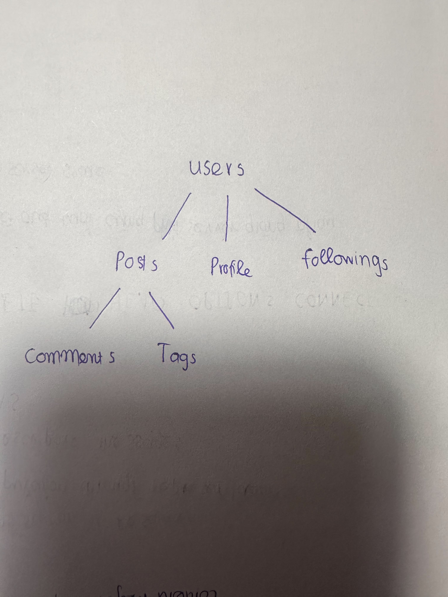

1. cac resources: 
users:
/api/v1/users
/api/v1/users/{user_id}
posts:
/api/v1/posts
/api/v1/posts/{post_id}
comments:
/api/v1/posts/{post_id}/comments
tags:
/api/v1/posts/{post_id}/tags
profile:
/api/v1/users/{user_id}/profile
following:
/api/v1/users/{user_id}/following

2. Phan loai:
Collection:
/users
/posts
/tags
Item:
/users/{user_id}
/posts/{post_id}
/tags/{tag_id}
Sub-resource:
/users/{user_id}/posts
/users/{user_id}/profile
/users/{user_id}/following

/posts/{post_id}/comments
/posts/{post_id}/tags

/tags/{tag_id}/posts

3. 
